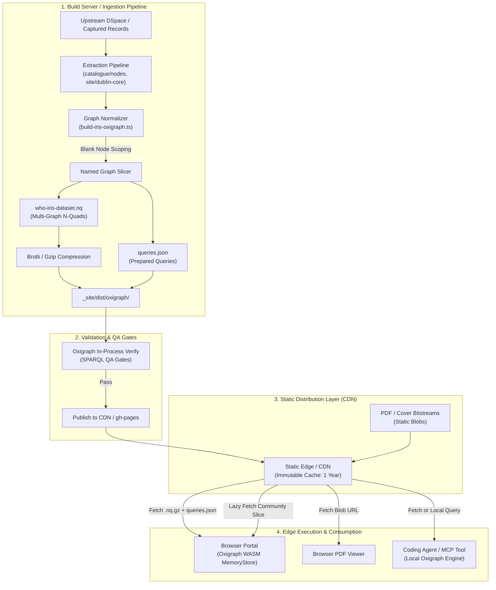

# Oxigraph Static Pipeline & Search Requirements

This document defines where **Oxigraph (WASM & CLI)** fits into the `folio-assistant` and `who-iris` publication pipelines, specifying how multi-graph metadata is compiled, verified, distributed via CDN, and queried at the edge.

> [!IMPORTANT]
> **Binary Asset Exclusion Rule**: Binary assets (scanned PDF documents, image bitstreams, page covers) are **never embedded in the named graph**. The RDF graph holds only typed entity descriptors, Dublin Core attributes, containment hierarchies, fixity digests (SHA-256), byte sizes, and HTTP/relative URLs. The binary bytes reside exclusively on static object storage/CDN.

---

## 1. Pipeline Architecture & Placement



---

## 2. Pipeline Integration Stages

### Stage 1: Build-Time Ingestion & Graph Slicing
- **Input:** 
  - `catalogue/nodes/*.json`: Communities, collections, item records, and bitstream manifests.
  - `site/dublin-core/*.dc.jsonld`: Qualified Dublin Core records conforming to `folio-assistant-core/schemas/dublin-core.ts`.
- **Tool:** `folio-assistant/who-iris/scripts/build-iris-oxigraph.ts`
- **Actions:**
  1. **Blank Node Disambiguation:** Prefix all blank nodes with the canonical item handle (`_:item_${handleClean}_${id}`) to prevent multi-document variable collision when merging.
  2. **Multi-Graph Assignment:**
     - `<https://iris.who.int/graph/catalogue>`: Top-level communities, collections, item parent-child paths, bitstream descriptors, and copyright gate verdicts.
     - `<https://iris.who.int/graph/metadata>`: Dublin Core titles, creators, issued dates, abstracts, spatial coverage, languages, and MESH subject authorities.
     - `<https://iris.who.int/graph/community/{id}>`: Partitioned subgraphs for lazy evaluation per administrative division.
  3. **Compression:** Produce `.nq` and pre-compressed `.nq.gz` / `.nq.br` payloads.
  4. **Query Manifest:** Export `queries.json` cataloging pre-compiled SPARQL queries for UI consumption.

### Stage 2: Build-Time SPARQL QA Gates
- Before any preview or release site is built, Oxigraph runs natively in Bun to execute semantic integrity checks:
  ```bash
  bun run who-iris/scripts/build-iris-oxigraph.ts
  bun test who-iris/scripts/tests/iris-oxigraph.test.ts
  ```
- **Integrity Criteria:**
  - *No orphan items:* Every item in the catalogue must declare at least one parent collection and community path.
  - *No unresolvable bitstreams:* Every bitstream node must declare fixity algorithm, digest, bytes, and mediaType.
  - *Authoritative handles:* Every item must declare an authoritative Handle (`10665/...`).

### Stage 3: Static CDN Distribution
- The generated assets are copied to `_site/who-iris/dist/oxigraph/` alongside the HTML replica:
  - `who-iris-dataset.nq.gz` (Combined graph)
  - `iris_who_int_graph_catalogue.nq.gz` (Lightweight catalogue backbone)
  - `iris_who_int_graph_community_{id}.nq.gz` (Partitioned regional subgraphs)
  - `queries.json` (Prepared queries)
- **Cache Policy:** `Cache-Control: public, max-age=31536000, immutable`. Content changes produce a new git commit hash or content-addressable filename.

### Stage 4: Client-Side Edge Execution (Browser WASM)
- In the frontend viewer:
  1. Browser initializes in-memory store: `const store = new oxigraph.Store();`
  2. Browser fetches the compressed catalogue or discovery slice (`~12–20 KB`).
  3. Browser streams decompressed N-Quads directly into WASM memory via `store.load(decompressedNq, { format: 'application/n-quads' })`.
  4. User UI interactions execute prepared SPARQL queries locally with zero server latency (< 5ms).
  5. If the user filters into a specific regional community or collection, the application lazily fetches that community's `.nq.gz` and mounts it into the live store with `store.load()` without wiping existing state.

---

## 3. Formal Requirements (Checkable Specifications)

| ID | Requirement | Verification Method |
| :--- | :--- | :--- |
| **SR-1** | **No Binary Embeddings in Graph**: No RDF object literal or URI may represent raw file binary bytes (base64 or blob data). Bitstreams must be modelled as nodes carrying `dspace:hasBitstream`, with `fileName`, `fileBytes` (integer), `mediaType`, and `fixity`. | Automated script checks: assert no literal length exceeds 8,192 characters (abstract ceiling). |
| **SR-2** | **Deterministic Blank Node Scoping**: Blank nodes generated from Dublin Core JSON-LD must be prefixed with the parent item handle to prevent collision across items. | Check graph with SPARQL: assert no blank node is shared by two distinct `?handle` subjects. |
| **SR-3** | **Multi-Graph Isolation**: Catalogue containment and rights gates must reside in `<https://iris.who.int/graph/catalogue>`; bibliographic records must reside in `<https://iris.who.int/graph/metadata>`. | SPARQL verification: `GRAPH <catalogue>` must contain only `dspace:` predicates; `GRAPH <metadata>` must contain `dcterms:` predicates. |
| **SR-4** | **Sub-50ms Query Execution**: Standard discovery and complex search queries over the materialized dataset must complete in under 50 milliseconds in WASM. | Measured in Bun/Playwright benchmarks in `iris-oxigraph.test.ts`. |
| **SR-5** | **Additive Subgraph Mounting**: Calling `store.load()` for an additional named subgraph must not clobber, mutate, or duplicate previously loaded quads. | Test verified: initial query returns N items; loading community slice returns N + M items without reload. |
| **SR-6** | **Handle Authority**: All item primary subject URIs must resolve using the canonical Handle system: `https://hdl.handle.net/10665/{id}`. | Graph check: all `a dspace:Item` subjects must start with `https://hdl.handle.net/`. |
| **SR-7** | **Compressed Transport Ceiling**: For the current 3-item library, the full gzipped multi-graph payload must not exceed 10 KB. For scale (300,000 items), regional community partitions must not exceed 25 MB compressed. | Measured build artifact size check in CI. |
| **SR-8** | **Prepared Query Equivalence**: Every entry in `queries.json` must be syntactically valid SPARQL 1.1 and execute against the dataset with 0 errors. | Automated test parses and dry-runs all queries in `queries.json`. |

---

## 4. Scale Modeling & Corpus Sizing (300,000 Items)

The WHO IRIS upstream repository contains **1,057,223 files** representing approximately **300,000 catalogued items** totaling **~361.55 GB to 0.7 TB** of scanned PDFs, reports, and image assets.

### Sizing Comparison: Raw Full-Text vs. Pure KG Extract in Oxigraph

| Metric | Raw Full-Text in Oxigraph | Pure KG Metadata Extract (Architecture Standard) |
| :--- | :--- | :--- |
| **Content Included** | Full OCR extracted page text + bibliographic metadata | Dublin Core, MeSH authorities, bitstream descriptors, access gates, hierarchy paths |
| **Binary Blobs in RDF** | **0** (strictly excluded) | **0** (strictly excluded) |
| **Quads / Triples** | ~45,000,000 quads (including sentence/paragraph chunks) | ~12,000,000 quads (~40 quads per item) |
| **Uncompressed N-Quads** | ~45 – 60 GB | ~1.2 – 1.5 GB |
| **Brotli / Gzip Payload** | ~8 – 12 GB compressed | **~95 – 140 MB compressed** (>90% compression ratio) |
| **Partition Size (per Community)** | ~1.2 – 1.8 GB compressed | **~12 – 20 MB compressed** |
| **WASM In-Memory RAM** | **> 4 GB** (Exceeds 32-bit WASM limit &rarr; **Browser Crash**) | **~35 – 65 MB RAM** per loaded partition |
| **Load Time over CDN (4G/Fiber)** | Impossible in browser | **150 ms – 350 ms** |
| **Query Latency** | Slow regex/filter scans (> 5,000 ms) | **< 15 ms** index-backed graph pattern matching |

### Architectural Recommendation
1. **Never load full text into Oxigraph.** SPARQL is a graph pattern matching engine; evaluating substring filters on millions of text literals is inefficient and exceeds browser memory boundaries.
2. **Hybrid Search Pipeline:**
   - Use a static inverted index (e.g. Pagefind, MiniSearch, or a sharded SQLite FTS5 WASM slice) for tokenized full-text keyword lookup.
   - The inverted index yields candidate item IRIs.
   - The candidate IRIs are passed into Oxigraph WASM via `VALUES ?item { ... }` to evaluate faceted filters, MeSH taxonomy hierarchies, collection constraints, and bitstream copyright clearance gates.

---

## 5. Registered Tools, Skills & Verification

### Executable Scripts & Tools
- `who-iris/scripts/build-iris-oxigraph.ts`: Multi-graph N-Quads compiler, blank node disambiguator, and Gzip compressor.
- `who-iris/scripts/iris-oxigraph-search.ts`: Search client supporting complex boolean SPARQL queries, faceted aggregations, and incremental subgraph mounting.
- `who-iris/scripts/gen-iris-pages.ts`: Static site generator incorporating structured KG metadata and faceted filtering controls into the landing page.

### Test Suites
- Unit test suite: `bun test who-iris/scripts/tests/iris-oxigraph.test.ts` (Validates graph build, quad integrity, SPARQL queries, and lazy mounting).
- End-to-end suite: `bunx playwright test cat-harness/test/who-iris-search.e2e.ts` (Validates browser search, facet chips, open-access gate filters, and multilingual UI).

### Formal Skills & Specifications
- `who-iris/skills/iris-oxigraph.md`: Registered in `who-iris/skills/package-manifest.json` under rules `OX-1` through `OX-8`.
- `who-iris/docs/oxigraph-pipeline-requirements.md`: System requirements `SR-1` through `SR-8`.
